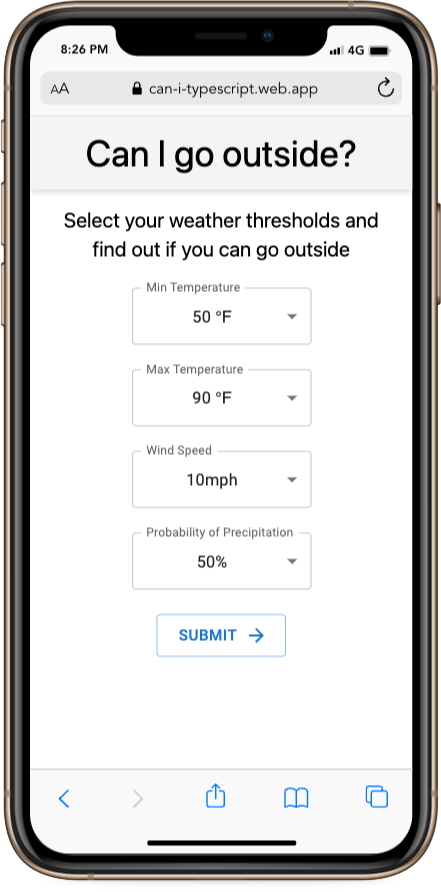
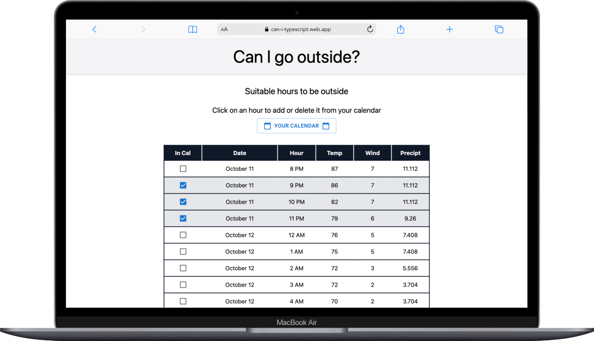
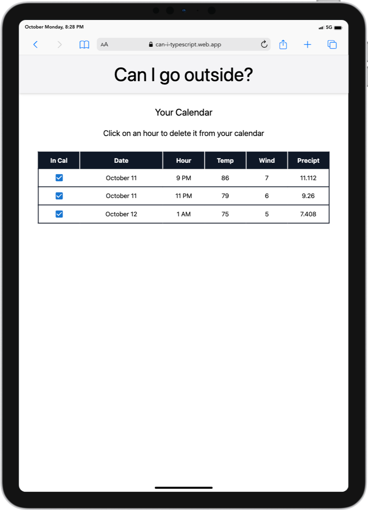

# Can I go look at a tree?

At Turing, we utilize the Pomodoro Technique which uses regularly scheduled breaks in order to maximize mental acuity. One of the instructors at Turing implores us to use this time to "Go look at a tree!" As a remote student in Florida, I found that the weather was often too inclement to "go look at a tree" during our scheduled POMs so I built this app.

This app utilizes an API built by the US National Weather Service, to determine if and when a user can go outside given weather thresholds that the user selected. The user is presented the number of hours they can go outside for or for how long they must wait. The user can see a list of hours that meet their selected thresholds and can add and remove any number of these hours to a personal calendar.

This project is deployed [here](https://can-i-typescript.web.app/).

## Features

* View of the homepage and search form on a mobile device

* View of the suitable hours page on a laptop

* View of the user's calendar on a tablet

## Technologies Used
This is a single-page application utilizing [React](https://reactjs.org/) and [React Router](https://reactrouter.com/). It is written in [TypeScript](https://www.typescriptlang.org/) and tested using [Cypress](https://www.cypress.io/). I am using [GitHub Actions](https://github.com/features/actions) for CI/CD. It is deployed to [Firebase](https://firebase.google.com/) Hosting as a [PWA](https://web.dev/progressive-web-apps/), and I am using features found in both to cache resources to the client allowing this app to be fully functional even in offline mode. I am using [Tailwind CSS](https://tailwindcss.com/) utility classes and [Material UI](https://mui.com/) components to make it look decent.

## Install
1. Clone down this repository `git clone https://github.com/alexmkio/can-i-typescript`
2. CD into your local clone `cd can-i-typescript`
3. Install project dependencies `npm install`
4. Run `npm start`
5. Open `http://localhost:3000/` in your preferred browser

## Contributors
This application was built by [Alex Kio](https://github.com/alexmkio/); a Front End Engineering, Mod 3 student at the [Turing School of Software and Design](https://turing.io/).